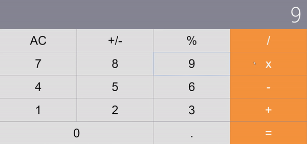

This is a project inspired by sample APP on React official website. Here is the link to the [original site](https://github.com/ahfarmer/calculator). Here I rewrote it with React template. It's a light-weight app and easy to follow. Hope it can help!

Before running the sample, please ensure you have installed [nodejs](https://nodejs.org/en/) on your computer.
The process contains only 3 steps:

1. run the command: npx create-react-app calculator

2. Copy the files in this repository into "calculator" directory. Overwrite all of them!

3. Run the command in "calculator" directory: npm start

Then you can take the enjoyment!