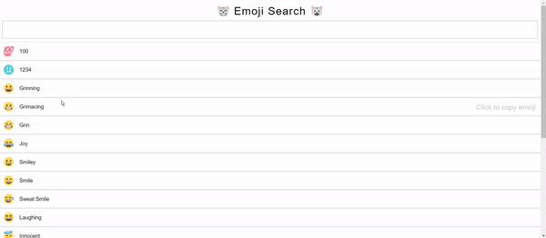

This is a project inspired by sample APP on React official website. Here is the link to the [original site](https://github.com/ahfarmer/emoji-search). Here I rewrote it with React template. Pay attention that "click to copy emoji" is not implemented here. Hope it can help!

Before running the sample, please ensure you have installed [nodejs](https://nodejs.org/en/) on your computer.
The process contains only 3 steps:

1. run the command: npx create-react-app emojiSearch

2. Copy the files in this repository into "emojiSearch" directory. Overwrite all of them!

3. Run the command in "emojiSearch" directory: npm start

Then you can take the enjoyment!